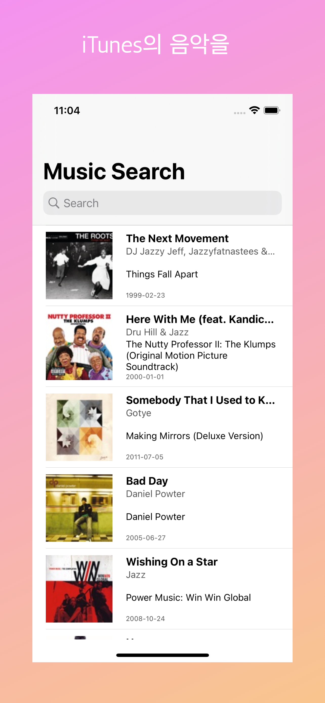
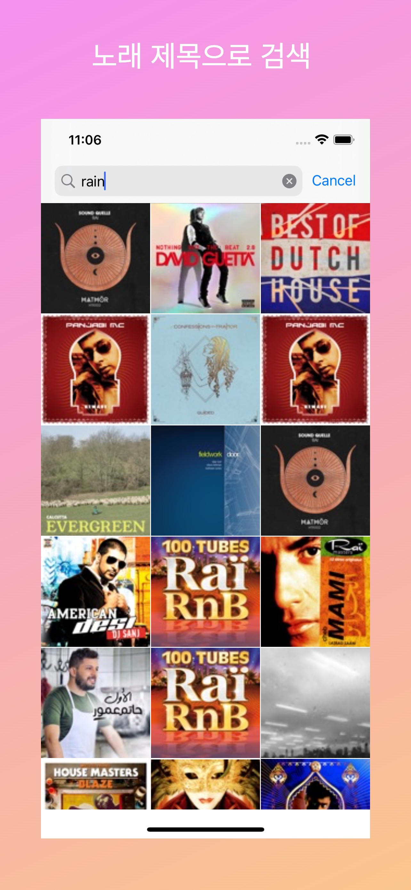

# Music App

태그: CollectionView, MVC, TableView, UISearchResultsUpdating, iTunesSearchAPI

- 네트워크 통신 후 받아온 데이터를 화면에 표시합니다.
    - 기본 화면에 장르 음악을 TableView로 표시
    - 음악 검색 후 검색 결과를 searchResultsController의 CollectionView로 표시

- iTunes Search API

